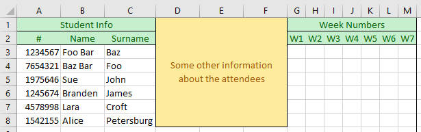
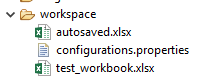
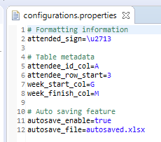

# Attendance-CLI

Attendance-CLI is an attempt to solve hours of <kbd>CTRL</kbd>+<kbd>F</kbd> and column counting while editing an Excel file.

Lets imagine you have your attendees signing a paper every week. At the end of some weeks, you have to
put their attendance statuses into a single Excel table. Normally you have to traverse every paper and
<kbd>CTRL</kbd>+<kbd>F</kbd> for that attendee ID and find corresponding week column to mark their attendance.

However it's easier and safer with Attendance-CLI! All you have to do is let it know about your tabular model
by modifying configuration file accordingly. Then start commanding it to find and mark attendees.

## Cool! But how?

1. Create a processable Excel model. It must preserve one whole column for attendee IDs. 
And it should preserve consecutive columns for week numbers.

2. Save that Excel model as an XLSL or XLSB file under `/workspace` folder

3. Configure properties accordingly. (See [configurations](#configurations))

4. Run the program via command line of choice.

5. Enjoy it. You can learn about commands via HELP command.

## Configurations

Configurations **MUST** be set correctly before using the program.
Here are the meanings of each property contained in `configurations.properties`:

- `attended_sign` : Sign/text to put on week column while attending an attendee.
- `attendee_id_col` : Alphabetical column no of attendee IDs.
- `attendee_row_start` : No of where attendee rows start.
- `week_start_col` : Alphabetical column no of where weeks start.
- `week_finish_col` : Alphabetical column no of where weeks finish.
- `autosave_enable` : Is auto save enabled? (true/false)
- `autosave_file` : Output file of auto save operation relative to `/workspace` folder.

## Questions

*Q:* It seems like a cool project built by a cool guy. Can I help improving it?  
*A:* Yes, totally! Either by connecting with me via Discord (iGoodie#1945), or making a PR on GitHub.

*Q:* I found a bug :cry: What can I do?  
*A:* Firstly I apologize for the bug if its a fatal one. Your [issues](https://github.com/iGoodie/Attendance-CLI/issues) are welcomed on GitHub.